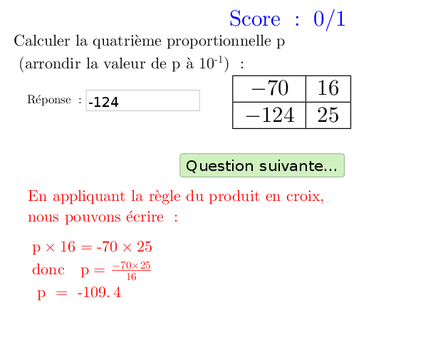

************
Proportionnalité
************

Pour commencer, un exercice de calcul de la quatrième proportionnelle.

Fichiers à télécharger
======================

.. list-table:: Calcul de proportionnalité
   :header-rows: 1

   * - Fichier
     - Description
   * - :download:`quatrieme prop.ggb <_static/exerciseur_quatrieme_proportionnelle.ggb>`
     - pourcentage direct (calculer une quantité à partir du taux)

Caractéristiques
================

* exercices sur 5 points (5 questions)
* valeurs aléatoires (quantités, unités, questions, etc.)
* notation automatique avec le plugin moodle : grâce à la variable *grade*
