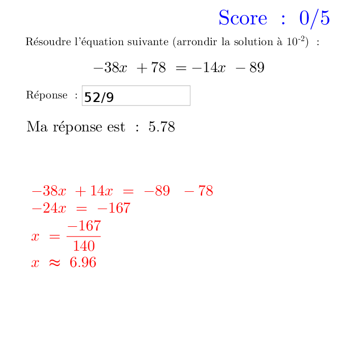

*****************************
Équation du premier degré
*****************************

Exercice sur la résolution d'équations du premier degré à une inconnue.
Alatoirement sont proposées des équations de type ax+b=0 ou ax+b=cx+d.

Fichiers à télécharger
======================

.. list-table:: Calcul d'images
   :widths: 30 70
   :header-rows: 1

   * - Fichiers
     - Description
   * - :download:`resolution equation degre1.ggb <_static/exerciseur_equation_degré1.ggb>`
     - calculer des équations du premier degré à une inconnue

Caractéristiques
================

* exercices sur 5 points (5 questions)
* valeurs aléatoires (quantités, unités, questions, etc.)
* notation automatique avec le plugin moodle : grâce à la variable *grade*
