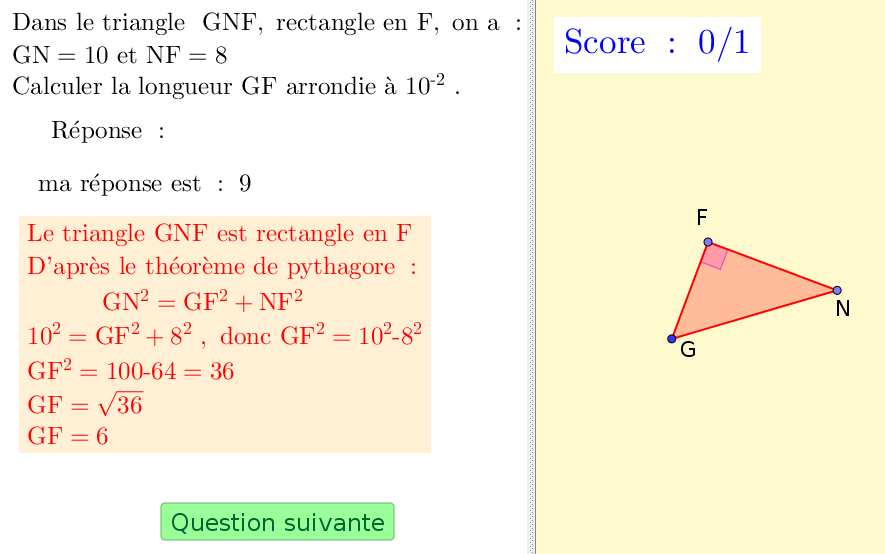

=========
Pythagore
=========

Fichiers à télécharger
======================

.. list-table:: Calcul de longueurs dans le triangle rectangle avec le théorème de Pythagore
   :header-rows: 1
   :widths: 2 2

   * - Fichier
     - Description
   * - `pythagore longueurs.ggb <_static/exerciseur_Pythagore_longueurs.ggb>`_
     - calculer des longueurs avec le théorème de Pythagore

Caractéristiques
================

* exercices sur 5 points (5 questions)
* valeurs aléatoires (quantités, unités, questions, etc.)
* notation automatique avec le plugin moodle : grâce à la variable *grade*
* correction personnalisée
