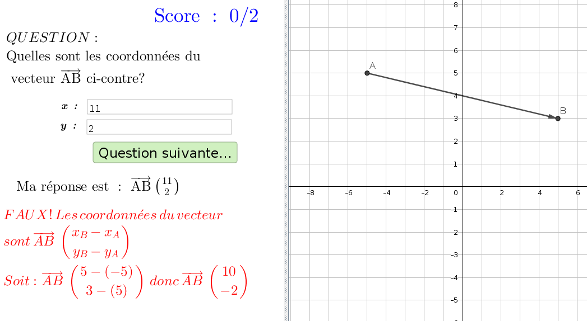

=====================
Vecteurs dans le plan
=====================
Série d'exercices sur les vecteurs dans le plan.

 #. Calcul des coordonnées d'un vecteur plan à partir des coordonnées de 2 points.
 #. Calcul de la norme d'un vecteur plan à partir des coordonnées de celui-ci.

Fichiers à télécharger
======================

.. list-table:: Coordonnées et normes dans le plan
   :header-rows: 1
   :widths: 2 2

   * - Fichier
     - Description
   * - :download:`coordonnées vecteur plan.ggb <_static/exerciseur_coordonnées vecteur plan.ggb>`
     - déterminer les coordonnées d'un vecteur plan
   * - :download:`norme vecteur plan.ggb <_static/exerciseur_norme vecteur plan.ggb>`
     - calculer la norme d'un vecteur dans le plan (à partir des coordonnées)

Caractéristiques
================

* exercices sur 5 points (5 questions)
* valeurs aléatoires (quantités, unités, questions, etc.)
* notation automatique avec le plugin moodle : grâce à la variable *grade*
* correction personnalisée

