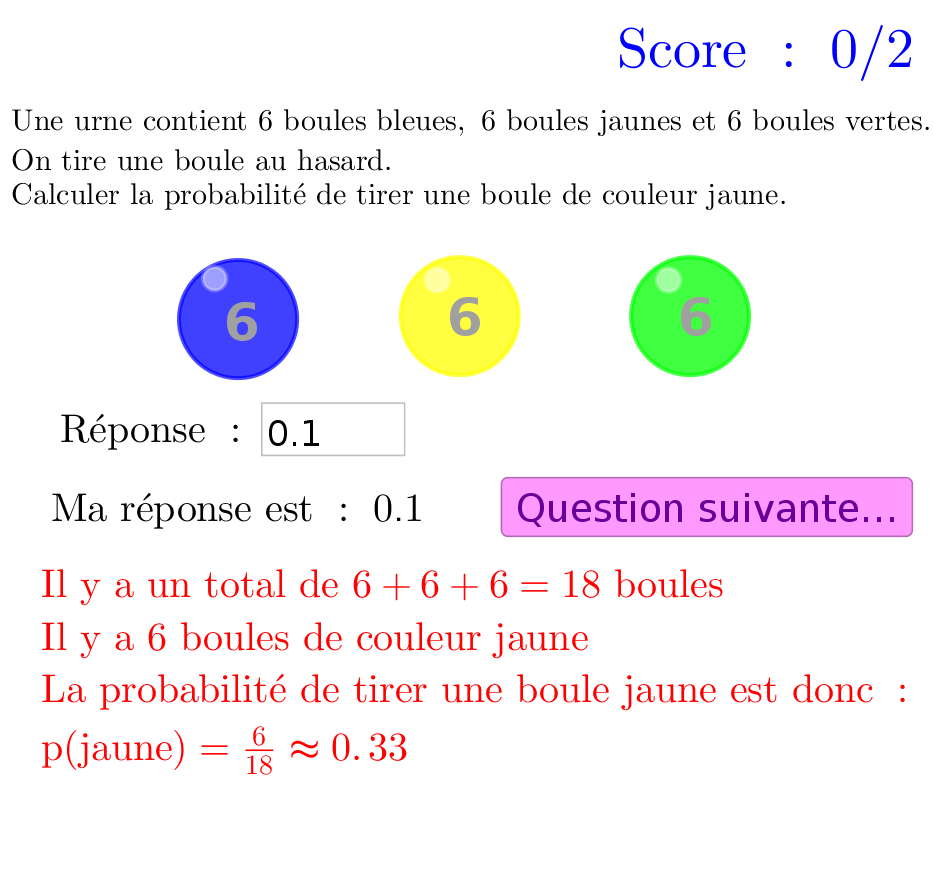

********************
Tirages aléatoires
********************

Fichiers à télécharger
======================

.. list-table:: probabilité d'un événement
   :widths: 30 70
   :header-rows: 1

   * - Fichiers
     - Description

   * - :download:`proba tirage urne.ggb <_static/exerciseur_proba_tirage.ggb>`
     - calculer la probabilité d'un événement à partir des populations

Caractéristiques
================

* exercices sur :

  * 5 points (5 questions) pour le premier
  * 10 points (10 questions) pour le second

* valeurs aléatoires (quantités, unités, questions, etc.)
* notation automatique avec le plugin moodle : grâce à la variable *grade*
