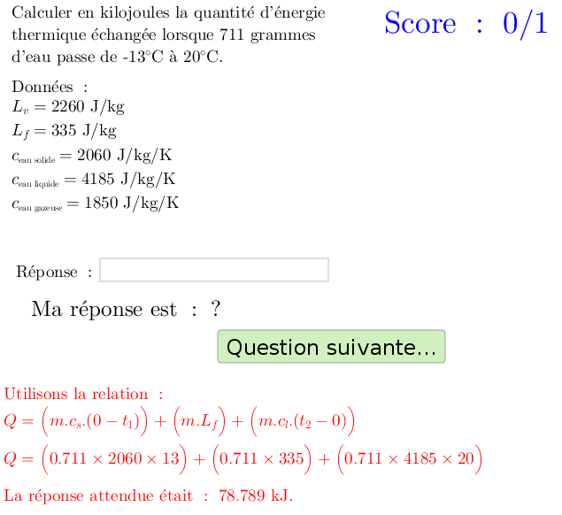

***********
Énergétique
***********

Série d'exercices sur les échanges énergétiques lors de changements de températures

 #. chaleur latente
 #. capacité thermique et changement d'état
 #. synthèse

.. image:: _static/fig-chgt02.png
   :width: 35%

Fichiers à télécharger
======================

.. list-table:: Poids, masse et constante gravitationnelle
   :widths: 30 70
   :header-rows: 1

   * - Fichiers
     - Description
     
   * - `capacité thermique.ggb <_static/exerciseur_chgt-etat_capaciteThermique.ggb>`_
     - utiliser la capacité thermique pour déterminer la quantité d'énergie échangée
          
   * - `chaleur latente.ggb <_static/exerciseur_chgt-etat_chaleurLatente.ggb>`_
     - utiliser la chaleur latente et le changement d'état à venir
       pour déterminer la quantité d'énergie échangée
          
   * - `synthèse.ggb <_static/exerciseur_chgt-etat_thermiqueTotale.ggb>`_
     - **synthèse** : utiliser changement d'été, chaleur latente et capacité thermique
       pour déterminer la quantité d'énergie échangée
        

     
Caractéristiques
================

* exercices sur 5 points (5 questions)  
* valeurs aléatoires (quantités, unités, questions, etc.)
* notation automatique avec le plugin moodle : grâce à la variable *grade*
